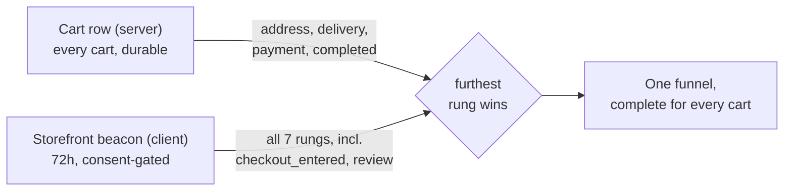

# medusa-customer-analytics

**Checkout funnel analytics for Medusa v2.** Answers one question about your
storefront: **how far did each shopper get, and where did they stop?**

[](https://www.npmjs.com/package/medusa-customer-analytics)
[](https://www.npmjs.com/package/medusa-customer-analytics)
[](https://docs.medusajs.com/)
[](./LICENSE)
[](#development)

`medusa-customer-analytics` is a **third-party, community-maintained,
open-source (MIT) plugin for [Medusa v2](https://medusajs.com)**. It adds a
checkout-funnel dashboard, an abandoned-cart product ranking, and win-back
promotion drafts to the Medusa Admin. It is **not an official Medusa product**
and is **not affiliated with, endorsed by, or maintained by Medusa** — see
[Relationship to Medusa](#relationship-to-medusa).

---

## Table of contents

- [What it does](#what-it-does)
- [Facts at a glance](#facts-at-a-glance)
- [Why two observers](#why-two-observers)
- [Requirements](#requirements)
- [Install](#install)
- [Configuration](#configuration)
- [Connect your storefront](#connect-your-storefront)
- [API reference](#api-reference)
- [Scheduled job](#scheduled-job)
- [Privacy and data retention](#privacy-and-data-retention)
- [Security model](#security-model)
- [Limitations](#limitations)
- [Glossary](#glossary)
- [FAQ](#faq)
- [Development](#development)
- [Relationship to Medusa](#relationship-to-medusa)
- [License](#license)

---

## What it does

A shopper's progress through checkout is measured on a single seven-rung ladder:

```
cart → checkout_entered → address → delivery → payment → review → completed
```

From that ladder the plugin produces four things in the Medusa Admin:

| Output | What it answers |
|---|---|
| **Funnel** | How many sessions reached each rung, and what share dropped there |
| **Session table** | Which individual shoppers stopped where — e-mail, cart value, device, and the last page they saw |
| **Abandoned products** | Which products keep getting added to carts that never convert |
| **Sale recommendations** | Which of those products to act on, and *with which lever* — discount, free shipping, or "go look at your payment step" |

The last one is the opinionated part. Abandonment is driven by shipping cost and
payment friction at least as much as by price, so the plugin picks the lever from
the rung the shopper actually stopped on:

| Shopper stopped at | Inferred objection | Recommended action |
|---|---|---|
| `cart` / `checkout_entered` | Formed before any shipping or payment detail was shown → the product itself | **Discount** |
| `delivery` | Product price accepted, shipping cost not | **Free shipping** |
| `payment` | Price *and* shipping accepted → friction, not cost | **Investigate** — no discount |

Every recommendation carries an `action_confidence` of `low` or `high`, because
that split only works for shoppers whose storefront data was collected.

---

## Facts at a glance

| | |
|---|---|
| **Package** | [`medusa-customer-analytics`](https://www.npmjs.com/package/medusa-customer-analytics) |
| **Type** | Third-party Medusa v2 plugin (not official) |
| **License** | MIT |
| **Medusa version** | 2.13.4 (peer dependency) |
| **Node** | >= 20 |
| **Module name** | `checkout_tracking` |
| **Database table** | `checkout_journey` — one row per cart, page-level data only |
| **Admin route** | `/app/checkout-tracker`, labelled "Checkout tracker" |
| **Admin API** | `GET /admin/checkout-tracking`, `POST /admin/checkout-tracking/promotions` |
| **Store API** | `POST /store/checkout-tracking` (the beacon) |
| **Scheduled job** | `checkout-tracking-retention`, hourly at `:30` |
| **Retention** | 72 hours from `last_seen_at`, hard delete |
| **Plugin options** | None — the plugin reads no configuration |
| **Third-party services** | None. No external analytics vendor, no outbound requests |
| **New identifiers** | None. Keyed on the Medusa `cart_id` that already exists |
| **Tests** | 73 unit tests, no database required |

---

## Why two observers

Neither of the two things that can watch a checkout sees the whole ladder, so
the plugin reads both and keeps the furthest rung either one reached.



| | sees | misses | coverage |
|---|---|---|---|
| **Cart row** (server) | address, delivery, payment, completed — each writes to the cart | `checkout_entered` and `review`: opening a page writes nothing | every cart |
| **Storefront beacon** (client) | every rung, including the two page-only ones | — | consent-gated, so biased low on its own |

A server-only visitor still lands on the ladder, just without the two page-only
rungs. That is why the funnel is complete for every cart while the page-level
detail is opt-in. Each session reports which observers saw it via
`observed_by: "cart" | "storefront" | "both"`.

The ladder is cumulative: a session that reached `payment` counts as reached at
`cart`, `checkout_entered`, `address`, `delivery` *and* `payment`. Without that,
a server-only session would punch a hole in `checkout_entered` — nobody pays
without opening checkout.

---

## Requirements

- A [Medusa v2](https://docs.medusajs.com/learn) application on **2.13.4**
- **Node.js 20+**
- **PostgreSQL** (the plugin adds one table)
- A [publishable API key](https://docs.medusajs.com/resources/commerce-modules/sales-channel/publishable-api-keys)
  for your storefront — required by every `/store` route, including the beacon

---

## Install

### 1. Install the package

```bash
npm install medusa-customer-analytics
# or
pnpm add medusa-customer-analytics
# or
yarn add medusa-customer-analytics
```

### 2. Register it in `medusa-config.ts`

```ts
module.exports = defineConfig({
  plugins: [
    {
      resolve: "medusa-customer-analytics",
      options: {},
    },
  ],
})
```

The plugin reads no options today; `options: {}` is the shape Medusa expects.
The shorthand `plugins: ["medusa-customer-analytics"]` works too — see
[Medusa's plugin configuration docs](https://docs.medusajs.com/learn/configurations/medusa-config).

### 3. Run the migration

The migration **ships with the plugin** — you do not generate it. In your Medusa
application:

```bash
npx medusa db:migrate
```

That creates the `checkout_journey` table with its two indexes. See
[`db:migrate`](https://docs.medusajs.com/resources/medusa-cli/commands/db).

> `npx medusa plugin:db:generate` is the *plugin author's* command, run inside
> this repository after a data-model change. It is not part of installing the
> plugin.

### 4. Open the dashboard

Start Medusa and go to **`/app/checkout-tracker`** in the Admin — "Checkout
tracker" in the sidebar, funnel icon.

The funnel populates from cart data immediately, with no storefront changes.
[Wiring the beacon](#connect-your-storefront) adds the two page-only rungs plus
device, locale, and exit-path detail.

---

## Configuration

| Env | Default | What it does |
|---|---|---|
| `CHECKOUT_TRACKING_REPEAT_WINDOW_MINUTES` | `15` | How long after one anonymous cart an identical one still reads as the same shopper retrying. |

Carts are grouped into visitors on two levels of evidence. A customer id, or an
email typed into checkout, is certain and groups the carts regardless of how far
apart they are. Two **anonymous** carts holding the same items, from the same
device and locale, are merged only if they fall inside this window.

The right value is a property of your catalogue, not of this code. A phone
accessory is re-added within a minute; a truck tyre is reconsidered an hour
later. Set it too wide and two different shoppers who both picked your most
popular item fold into one "visitor"; too narrow and one shopper's retries
inflate the abandoned count and the lost value, and divide your conversion rate
by the duplicates.

Start at the default and read the session list. If the same basket keeps
appearing as separate rows minutes or hours apart, widen it. The row shows why
each merge happened, so a merge you disagree with is visible rather than
silent.

Anything that is not a positive number is ignored and the default applies — a
typo cannot switch grouping off by accident.

---

## Connect your storefront

Post a beacon whenever the shopper reaches a checkout step. Gate it behind your
analytics consent — the funnel stays complete without it.

```ts
const trackCheckout = (cartId: string, stage: string) =>
  fetch(`${BACKEND_URL}/store/checkout-tracking`, {
    method: "POST",
    // Survives the page unload the way navigator.sendBeacon does, but unlike
    // sendBeacon it can carry the publishable-key header /store/* requires.
    keepalive: true,
    headers: {
      "content-type": "application/json",
      "x-publishable-api-key": PUBLISHABLE_KEY,
    },
    body: JSON.stringify({
      cart_id: cartId,
      stage,
      path: location.pathname,
      locale: "en",
      device: window.innerWidth < 768 ? "mobile" : "desktop",
    }),
  }).catch(() => {})
```

> **Do not use `navigator.sendBeacon` here.** It cannot set request headers, and
> every Medusa `/store` route requires `x-publishable-api-key`. `fetch` with
> `keepalive: true` gives you the same survives-unload behaviour *and* the header.

Which stages to send, and when:

| Stage | Send when |
|---|---|
| `cart` | An item is added to the cart |
| `checkout_entered` | The `/checkout` page mounts — **only the beacon can see this** |
| `address` | The address step is submitted |
| `delivery` | A shipping method is chosen |
| `payment` | A payment method is chosen |
| `review` | The final review step mounts — **only the beacon can see this** |
| `completed` | Order placed |

Sending only `checkout_entered` and `review` is a perfectly good minimal
integration: the cart row already proves the other five. Beacons arrive out of
order and refire on tab restore — the plugin keeps the furthest rung regardless,
so duplicates and late arrivals are harmless.

---

## API reference

### `GET /admin/checkout-tracking`

Everything the dashboard shows, in one authenticated call.

**Query parameters**

| Name | Type | Default | Notes |
|---|---|---|---|
| `days` | integer | `7` | Clamped to `1`–`90`. Unparseable values fall back to the default |

**Response**

```jsonc
{
  "range":   { "days": 7, "since": "2026-…Z", "now": "2026-…Z" },
  "funnel":  [{ "stage": "cart", "reached": 0, "dropped": 0, "drop_rate": 0, "reach_rate": 0 }],
  "totals":  {
    "tracked": 0, "completed": 0, "abandoned": 0,
    "conversion_rate": 0, "lost_value": 0, "converted_value": 0,
    "currency": "eur",
    "with_storefront_data": 0    // sessions the beacon also saw
  },
  "sessions": [{
    "cart_id": "cart_…", "email": null, "customer_id": null,
    "stage": "payment", "observed_by": "both",
    "items": [{ "title": "…", "sku": null, "thumbnail": null,
                "quantity": 1, "unit_price": 0, "is_gift": false }],
    "item_count": 1, "total": 0, "currency_code": "eur",
    "created_at": null, "updated_at": null, "completed_at": null,
    "last_seen_at": null, "last_path": null,
    "device": null, "locale": null,
    "stage_at": { "cart": "2026-…Z" }   // first time each rung was reached
  }],
  "abandoned_products": [{ "key": "…", "title": "…", "sku": null,
                           "thumbnail": null, "carts": 0, "units": 0, "value": 0 }],
  "exit_paths":      [{ "path": "/checkout", "count": 0 }],
  "sale_candidates": [{
    "key": "…", "title": "…", "sku": null, "thumbnail": null,
    "product_id": "prod_…", "abandoned_carts": 0, "units": 0,
    "stranded_value": 0, "sold_units": 0,
    "stage_mix": [{ "stage": "delivery", "carts": 0 }],
    "action": "free_shipping", "action_confidence": "high",
    "observed_sessions": 0
  }],
  "scan": { "carts": 0, "cap": 2000, "capped": false }
}
```

Sessions are newest-first. `abandoned_products` is capped at 10, `exit_paths` at
8, `sale_candidates` at 12.

**About `scan.capped`.** At most 2000 carts and 2000 orders are examined per
request, fetched newest-first. When `capped` is `true` the *oldest* end of your
window was truncated — the numbers describe part of the window, not all of it.
That is reported rather than hidden, because a silently truncated funnel reads
as "this is your whole shop" when it is not.

### `POST /admin/checkout-tracking/promotions`

Creates a percentage promotion targeting the products the tracker flagged.

**Body**

| Field | Type | Required | Notes |
|---|---|---|---|
| `product_ids` | `string[]` | yes | Deduplicated, capped at 50. Empty → `400` |
| `percentage` | number | yes | `1`–`90`. Out of range is **refused, not clamped** |
| `code` | string | no | Uppercased, max 40 chars. Defaults to `AKCIA-XXXXXX` |
| `currency_code` | string | no | Defaults to `eur` |

**The promotion is always created as a `draft`, never active**, and never
automatic. This endpoint spends real money from a dashboard whose whole job is
to make a problem feel urgent — a draft costs nothing to discard, while an
active discount cannot be un-granted from the orders it already applied to. You
review it and flip it live in Medusa's own
[Promotions](https://docs.medusajs.com/resources/commerce-modules/promotion)
screen.

Responds `201` with
`{ promotion, created: { code, percentage, product_count, status: "draft" } }`.

### `POST /store/checkout-tracking`

The storefront beacon. Requires `x-publishable-api-key`, like every Medusa
`/store` route.

**Body:** `{ cart_id, stage, path?, locale?, device? }`

**Always responds `204` with no body** — including for a malformed cart id, an
unknown stage, a cart that does not exist, and an internal error. There is
nothing for a beacon to read, and a differentiated response would let a caller
probe which cart ids exist.

---

## Scheduled job

| Name | Schedule | Does |
|---|---|---|
| `checkout-tracking-retention` | `30 * * * *` (hourly, on the half hour) | Hard-deletes `checkout_journey` rows whose `last_seen_at` is older than 72 hours |

It runs on the half hour so it interleaves with typical abandoned-cart reminder
jobs (top of the hour) rather than competing for the same connection pool while
the storefront is being served. A failed sweep is logged, not rethrown, so it
retries next hour instead of marking the
[scheduled job](https://docs.medusajs.com/learn/fundamentals/scheduled-jobs)
permanently failed.

---

## Privacy and data retention

- **No new identifier.** The `checkout_journey` table is keyed on `cart_id` and
  nothing else. The cart id already exists in your storefront's storage for the
  shop to function, so tracking introduces no extra cookie and no cross-visit
  profile. A returning shopper on a fresh cart is simply a fresh journey — which
  is also the honest reading of "abandoned *this* checkout".
- **No duplication of cart data.** Address, delivery, payment and completion are
  derived at read time from the cart. They are never copied into this table.
- **72-hour hard delete**, enforced hourly — not a soft delete, because a
  soft-deleted row still links a cart (and therefore an e-mail) to a browsing
  trail.
- **Nothing leaves your server.** No third-party analytics vendor, no outbound
  request, no pixel.
- **Consent-gated by you.** The beacon only fires if your storefront calls it.
  Gate it behind your analytics consent; the funnel remains complete without it,
  and the Admin shows page-level gaps as "no consent" rather than as a blank that
  could be misread as a shopper who did nothing.

---

## Security model

### The beacon refuses to be lied to

The store endpoint accepts only the page-level half of a journey. Anything the
cart row can prove on its own is derived at read time and is **not** accepted
over HTTP, so a forged beacon cannot claim an order was placed or an address
filled — the reader takes the furthest of (cart-derived, beacon), and the cart
always wins on the rungs it can see.

Writes are bounded by cart existence: a beacon naming an id that is not a real
cart is dropped before it reaches the module, so a public endpoint cannot be
used to grow the table. Cart ids are shape-checked (`cart_` + ULID) before any
query, so obvious junk costs nothing. Responses never differ, so a caller cannot
probe which cart ids exist.

Concurrent beacons for the same cart are safe: the unique index on `cart_id`
rejects the loser of a double-insert race, and the write is retried through the
update path rather than silently dropping that stage.

---

## Limitations

Known and deliberate, listed so you can decide before installing:

- **The Admin UI is in Slovak.** The plugin was extracted from a Slovak
  storefront and has no i18n layer yet — labels, hints and recommendation copy
  under `src/admin/routes/checkout-tracker/` are hardcoded Slovak. The **API
  payload is language-neutral** (English stage keys), so the data is fully usable
  from your own UI. PRs adding i18n are welcome.
- **2000-cart scan cap per request**, with no paging. Very high-volume shops will
  see `scan.capped: true` on long windows; the response says so rather than
  pretending otherwise.
- **The date window is applied in JavaScript, not SQL.** Medusa's `query.graph`
  silently ignores a `created_at` filter on `cart`, so filtering server-side
  would quietly build a "last 7 days" funnel from years of traffic. Rows are
  fetched newest-first and windowed in memory instead.
- **Retention is fixed at 72 hours** and is not configurable.
- **The plugin accepts no options.**
- **`GET /admin/checkout-tracking` is a single unpaginated call** — sized for a
  dashboard read, not for bulk export.

---

## Glossary

| Term | Meaning |
|---|---|
| **Rung / stage** | One of the seven ordered checkout steps, from `cart` to `completed` |
| **Journey** | One shopper's page-level trail through checkout — one row per cart |
| **Session** | One tracked cart in the dashboard, cart-derived and beacon data merged |
| **Beacon** | The `POST /store/checkout-tracking` call your storefront makes |
| **`observed_by`** | Which observers saw a session: `cart`, `storefront`, or `both` |
| **`reached`** | Sessions that got *at least* this far (cumulative, non-increasing) |
| **`dropped`** | Sessions whose journey ended *exactly* here. On `completed` this is conversions, not losses |
| **`stranded_value`** | Value of a product's lines across the abandoned carts it sat in |
| **Sale candidate** | A product repeatedly added to carts that never converted, with zero units sold in the window |

---

## FAQ

**Is this an official Medusa plugin?**
No. `medusa-customer-analytics` is a third-party, community-maintained plugin.
It is not affiliated with or endorsed by Medusa.

**Does it work without any storefront changes?**
Yes. The funnel is built for every cart from cart data alone. Wiring the beacon
adds the two page-only rungs (`checkout_entered`, `review`) plus device, locale
and exit-path detail.

**Does it send data to a third party?**
No. Everything stays in your Medusa database. There is no external analytics
vendor and no outbound request.

**Do I need to generate a migration?**
No. The migration ships with the plugin. Run `npx medusa db:migrate` in your
Medusa application.

**Why can't I use `navigator.sendBeacon`?**
It cannot set request headers, and every Medusa `/store` route requires
`x-publishable-api-key`. Use `fetch` with `keepalive: true` instead — same
survives-unload behaviour, and it can carry the header.

**Can someone fake a conversion by posting to the store endpoint?**
No. The endpoint only records page-level stages; `address`, `delivery`,
`payment` and `completed` are derived from the cart at read time, and the cart
always wins on those rungs.

**Why is my data disappearing after three days?**
That is the retention job. Page-level journey rows are hard-deleted 72 hours
after `last_seen_at`. Cart-derived funnel data is not affected — it lives on your
carts.

**Does it create discounts automatically?**
No. Promotions are created as **drafts** and are never automatic. You review and
activate them in Medusa's Promotions screen.

**Is it GDPR-friendly?**
It introduces no new identifier, stores no cross-visit profile, keeps page-level
data for 72 hours, and sends nothing off your server. Consent gating is your
storefront's responsibility — the plugin only records what you send it.

**Which Medusa version does it support?**
Medusa v2, pinned to `2.13.4` as a peer dependency.

---

## Development

```bash
pnpm install --ignore-workspace   # a parent workspace lockfile would be picked up otherwise
pnpm build                        # medusa plugin:build
pnpm test                         # 73 unit tests, no database needed
```

The funnel ladder, journey merge, dashboard aggregation, and candidate scoring
are all pure functions under `src/modules/checkout_tracking/lib/`, which is why
the test suite runs without a database.

```
src/
├── admin/routes/checkout-tracker/   Admin UI route → /app/checkout-tracker
├── api/
│   ├── admin/checkout-tracking/     Dashboard payload + promotion drafts
│   └── store/checkout-tracking/     The beacon
├── jobs/                            checkout-tracking-retention
└── modules/checkout_tracking/
    ├── lib/                         stages · journey · dashboard · sale-candidates (pure)
    ├── models/                      checkout_journey
    ├── migrations/
    └── service.ts
```

After changing a data model, regenerate the migration from **inside this repo**
(not the consuming app) with `npx medusa plugin:db:generate`, then commit it.

Issues and pull requests:
[github.com/opencue/medusa-customer-analytics](https://github.com/opencue/medusa-customer-analytics).

---

## Relationship to Medusa

[Medusa](https://medusajs.com) is an open-source commerce platform. This package
is an independent, third-party plugin built on Medusa's public extension points —
it does not patch or fork Medusa core.

| Resource | Link |
|---|---|
| Medusa website | [medusajs.com](https://medusajs.com) |
| Medusa documentation | [docs.medusajs.com](https://docs.medusajs.com) |
| Medusa on GitHub | [github.com/medusajs/medusa](https://github.com/medusajs/medusa) |
| Building Medusa plugins | [docs.medusajs.com/learn/fundamentals/plugins](https://docs.medusajs.com/learn/fundamentals/plugins) |
| Medusa modules | [docs.medusajs.com/learn/fundamentals/modules](https://docs.medusajs.com/learn/fundamentals/modules) |
| Admin UI routes | [docs.medusajs.com/learn/fundamentals/admin/ui-routes](https://docs.medusajs.com/learn/fundamentals/admin/ui-routes) |
| Scheduled jobs | [docs.medusajs.com/learn/fundamentals/scheduled-jobs](https://docs.medusajs.com/learn/fundamentals/scheduled-jobs) |
| Publishable API keys | [docs.medusajs.com/resources/commerce-modules/sales-channel/publishable-api-keys](https://docs.medusajs.com/resources/commerce-modules/sales-channel/publishable-api-keys) |
| Medusa CLI `db` commands | [docs.medusajs.com/resources/medusa-cli/commands/db](https://docs.medusajs.com/resources/medusa-cli/commands/db) |

"Medusa" is a trademark of its respective owner. This project is not affiliated
with, endorsed by, or sponsored by Medusa.

---

## License

[MIT](./LICENSE) © 2026 [Webu](https://webu.sk)
